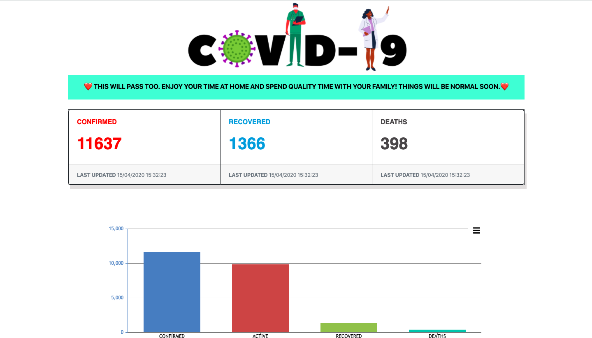
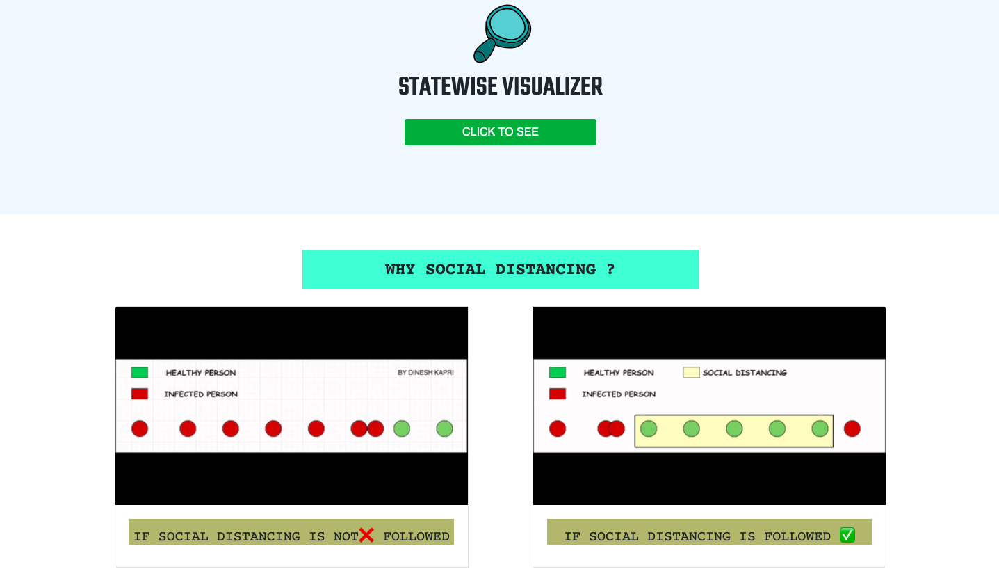
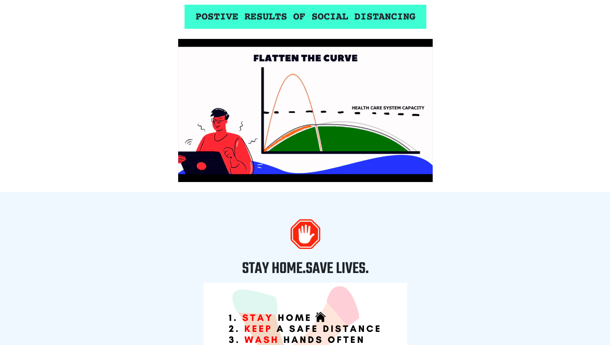
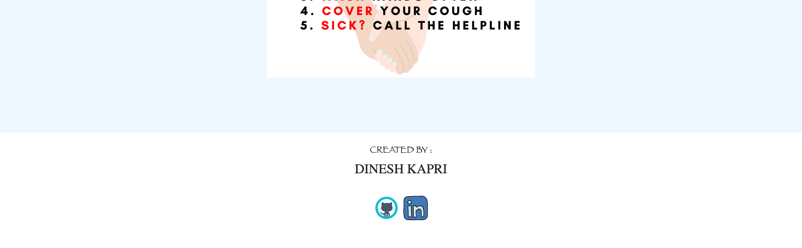

**COVID-19 Tracker**

**INSTALLING THE PACKAGES :

CREATE JSON PACKAGE :

        npm init

INSTALL NODEMON :

        npm install -g nodemon
        (Require for starting server automtically, don't need to run server everytime with change in file) 
        
INSTALL EJS (Embedded JavaScript templates ) :
        
        npm i express ejs --save
        (Require for rendering the html file )
        
INSTALL REQUEST PACKAGE :

        npm i express request --save
        (Require for Requesting data from an API)
      
**FOR RUNNING THE FILE :

        nodemon app.js ( filename )
        
        
**SCREENSHOTS:

   
        
        
        

        
        
